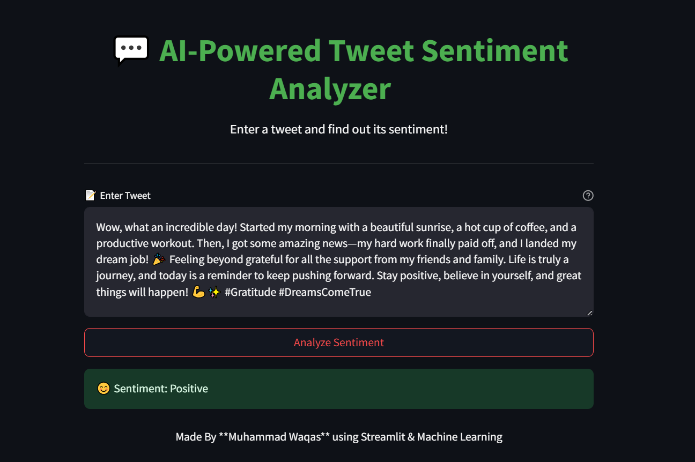

# **VibeChecker AI**


Welcome to the **VIBECHECKER AI**! This project is a machine learning-based web application that analyzes the sentiment of tweets, classifying them as either **Positive** or **Negative**. Built using **Python**, **Streamlit**, and **Scikit-learn**, this project demonstrates my skills in **Natural Language Processing (NLP)**, **Machine Learning**, and **Web App Development**.

---

## **Table of Contents**
- [**VibeChecker AI**](#vibechecker-ai)
  - [**Table of Contents**](#table-of-contents)
  - [**Project Overview**](#project-overview)
  - [**Key Features**](#key-features)
  - [**Technologies Used**](#technologies-used)
  - [**Project Structure**](#project-structure)
  - [**How It Works**](#how-it-works)
  - [**Installation Guide**](#installation-guide)
    - [**Prerequisites**](#prerequisites)
    - [**Steps**](#steps)
  - [**Usage**](#usage)
  - [App Preview](#app-preview)
  - [](#)
  - [**Results**](#results)
  - [**Future Improvements**](#future-improvements)
  - [**Contributing**](#contributing)
  - [**Contact**](#contact)

---

## **Project Overview**

In this project, I built an end-to-end machine learning pipeline for sentiment analysis on tweets. The project includes:
- **Exploratory Data Analysis (EDA)** and **Data Preprocessing**.
- **Model Building** using **Logistic Regression** and **Multinomial Naive Bayes**.
- **Hyperparameter Tuning** using **GridSearchCV**.
- Deployment of the model as a **Streamlit Web Application**.

The final application allows users to input a tweet and get an instant sentiment prediction (Positive or Negative). This project is a great example of how machine learning can be applied to real-world problems, such as understanding public sentiment on social media.

---

## **Key Features**

- **Text Preprocessing**: Cleans and preprocesses tweets by removing mentions, URLs, special characters, and stopwords. Also performs stemming to normalize words.
- **Machine Learning Models**: Trains and evaluates multiple models (Logistic Regression and Naive Bayes) to classify tweet sentiment.
- **Hyperparameter Tuning**: Uses **GridSearchCV** to find the best hyperparameters for each model.
- **Web Application**: A user-friendly **Streamlit** app that allows users to input a tweet and get a sentiment prediction in real-time.
- **Scalable Pipeline**: The project is designed to handle large datasets (1.6 million tweets) and can be extended for more advanced models.

---

## **Technologies Used**

- **Programming Language**: Python
- **Libraries**:
  - **Data Manipulation**: Pandas, NumPy
  - **Machine Learning**: Scikit-learn
  - **Natural Language Processing**: NLTK, TfidfVectorizer
  - **Web App Development**: Streamlit
- **Model Deployment**: Pickle (for saving models and vectorizers)
- **Version Control**: Git, GitHub

---

## **Project Structure**

```
VIBECHECK AI/
├── Artifacts/                  
│   ├── Logistic Regression.pkl  
│   ├── Logistic_Regression.pkl  
│   ├── preview.png              
│   ├── raw_data.csv             
│   ├── vectorizer.pkl           
│   ├── x_test.csv               
│   ├── x_train.csv              
│   ├── y_test.csv               
│   └── y_train.csv          
│
├── Assets/                    
│   └── Main Dataset link.txt    
│
├── Notebooks/                 
│   ├── EDA_Data_Preprocessing.ipynb  
│   └── model_building.ipynb          
│
├── .gitattributes              
├── .gitignore                 
├── app.py                 
├── README.md               
└── requirements.txt                         
```

---

## **How It Works**

1. **Data Preprocessing**:
   - Tweets are cleaned by removing mentions, URLs, and special characters.
   - Text is converted to lowercase, and stopwords are removed.
   - Words are stemmed to their root forms using the Snowball Stemmer.

2. **Model Training**:
   - The preprocessed data is vectorized using **TfidfVectorizer**.
   - Two models (**Logistic Regression** and **Multinomial Naive Bayes**) are trained and evaluated.
   - Hyperparameters are tuned using **GridSearchCV** for optimal performance.

3. **Sentiment Prediction**:
   - The best-performing model (Logistic Regression) is saved and used for predictions.
   - The Streamlit app takes a user-input tweet, preprocesses it, and predicts the sentiment using the trained model.

---

## **Installation Guide**

### **Prerequisites**
- Python 3.8 or higher
- Git (optional)

### **Steps**
1. Clone the repository:
   ```bash
   git clone https://github.com/waqas-liaqat/VibeChecker-AI.git

   cd Tweet-Sentiment-Analyzer
   ```

2. Install the required dependencies:
   ```bash
   pip install -r requirements.txt
   ```

3. Download NLTK resources:
   ```python
   python -c "import nltk; nltk.download('punkt'); nltk.download('stopwords')"
   ```

4. Run the Streamlit app:
   ```bash
   streamlit run app.py
   ```

5. Open your browser and go to `http://localhost:8501` to use the app.

---

## **Usage**

1. Enter a tweet in the text box.
2. Click the **"Analyze Sentiment"** button.
3. The app will display the sentiment as either **Positive** or **Negative**.
## App Preview

---

## **Results**

- **Best Model**: Logistic Regression
- **Accuracy**: 77.8%
- **Validation Score**: 77.7%

---

## **Future Improvements**

- **Advanced Models**: Experiment with deep learning models like LSTM or BERT for better accuracy.
- **Real-Time Data**: Integrate with Twitter API to analyze live tweets.
- **Multi-Class Sentiment**: Extend the model to classify tweets into more categories (e.g., Neutral, Mixed).
- **User Feedback**: Allow users to provide feedback on predictions to improve the model over time.

---

## **Contributing**

Contributions are welcome! If you'd like to contribute, please follow these steps:
1. Fork the repository.
2. Create a new branch (`git checkout -b feature/YourFeatureName`).
3. Commit your changes (`git commit -m 'Add some feature'`).
4. Push to the branch (`git push origin feature/YourFeatureName`).
5. Open a pull request.

---

## **Contact**

- **Name**: Muhammad Waqas
- **Email**: waqasliaqat630@gmail.com
- **LinkedIn**: [LinkedIn](https://www.linkedin.com/in/muhammad-waqas-liaqat/)
- **GitHub**: [GitHub](https://github.com/waqas-liaqat)

---

Thank you for checking out my project! If you have any questions or feedback, feel free to reach out. 😊